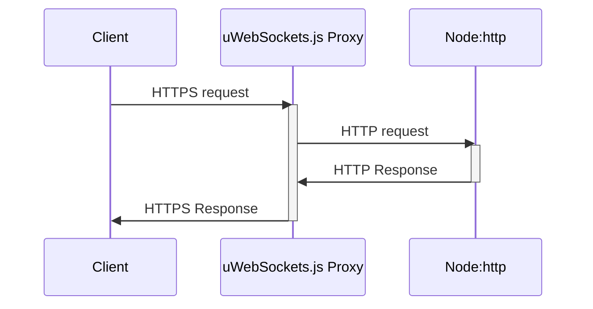

# uws-compat-layer

This project is a **easy-to-use 0-dependency**\* compatibility layer for `uWebSockets.js`. It enables use of `uWebSockets.js` and other `node:http`
compatible libraries (as [express](https://www.npmjs.com/package/express)) on **the same port**.

Tested with:

- uWebSockets.js v20.10.0
- NodeJS v18.0.0

\[\*\]: This package do not even depends on `uWebSockets.js` to not force any version usage, see in examples below.

## How does it works?

It basically use `uWebSockets.js` as a naive proxy for all non-websocket trafic and forward it to your
`node:http` based module/backend/application.

Then it will send the response back to the client without modification.

**Keep in mind that this package is not aimed to be a generic proxy based on `uWebSockets.js`.**

## Why? For what use case?

Don't use this package if you don't **really** need it.

You pretty much always want your NodeJS app available on only one port (**443**) for it to be accessible in restrictive **NATs**,
but you won't necessarily have to use install your server in a **restricted production environment**.

This project is aimed to provide a solution in **restricted server environments** such
as some cloud platforms like Heroku, where you can't set up a real proxy in front of your NodeJS application.

If you're not in a similar use case, just set up an **Nginx** or **Apache** proxy that will filter the requests to redirect them on
the good **private** port.

If your server have to work in **restricted server environment** or if for whatever reason you want `uWebSockets.js` 
to handle all requests without standing behind a proxy, then this package is made for you :)

In the case of **express** you _could_ use a package like [http-proxy-middleware](https://www.npmjs.com/package/http-proxy-middleware)
to do the opposite (using `express` as a proxy to forward requests to `uWebSockets.js`), but this doesn't seem to work at the time
I'm writing this, and **it defeats the main advantage of `uWebSockets.js`**: its astonishing performances.

## Important note about SSL

The `http` part of your NodeJS application will be used over `http`, not `https` because `uWebSockets.js` will handle the https part, and since
you're in a scenario where you want both `websockets` server and `http` server in the same app, it would not be very efficient to use SSL to
secure what only happen locally.



## Installation

With npm:

```bash
npm install github:jordan-breton/uws-compat-layer#v2.0.0
```

With yarn:

```bash
yarn add github:jordan-breton/uws-compat-layer#v2.0.0
```

## Usage

This section describe some usage scenario. You can even see them in action in the 
[examples repository](https://github.com/jordan-breton/uws-compat-layer-examples)

### Basic

Simplest use-case: let the proxy create everything on its own, configure your servers afterward.

```js
const uWebSockets = require('uWebSockets.js');

const {
	UWSProxy,
	createUWSConfig
} = require('uws-compat-layer');

const port = process.env.PORT || 80;

const proxy = new UWSProxy(
	createUWSConfig(
		uWebSockets,
		{ port }
	)
);
proxy.start();

// Adding a handler to the http server created by the proxy
proxy.http.server.on('request', (req, res) => { 
	console.log('Incoming request: ', req);

	res.writeHead(200);
	res.end('Hello world :)');
});

// Configuring the uWebSockets.js app created by the proxy

// Setting up websockets
proxy.uws.server.ws({
	upgrade : () => { /*...*/ }
	/* ... */
});

// Listening
proxy.uws.server.listen('0.0.0.0', port, listening => {
	if(listening){
		console.log(`uWebSockets.js listening on port 0.0.0.0:${port}`);
	}else{
		console.error(`Unable to listen on port 0.0.0.0:${port}!`);
	}
});
```

**Note:** You can add a callback for the `http` listening event:

```js
const uWebSockets = require('uWebSockets.js');

const {
	UWSProxy,
	createUWSConfig,
	createHTTPConfig,
} = require('uws-compat-layer');

const port = process.env.PORT || 80;

const proxy = new UWSProxy(
	createUWSConfig(
		uWebSockets,
		{ port }
	),
	createHTTPConfig(
		null,
		{
			on: {
				listen: () => console.log('HTTP server listening on private port 127.0.0.1:35794')
			}
		}
	)
);
```

Second use case: providing an already created `http` server, that is **not listening to any port yet**:

```js
const http = require('http');
const uWebSocket = require('uWebSockets.js');

const {
	UWSProxy,
	createUWSConfig,
	createHTTPConfig 
} = require('uws-compat-layer');

const port = process.env.PORT || 80;

const httpServer =  http.createServer(/*...*/);

const proxy = new UWSProxy(
	createUWSConfig(
		uWebSocket,
		{ port }
	),
	createHTTPConfig(
		httpServer
	)
);
proxy.start();

proxy.uws.server.ws({
	upgrade : () => { /*...*/ },
	/* ... */
});

proxy.uws.server.listen('0.0.0.0', port, listening => {
	if(listening){
		console.log(`uWebSockets.js listening on port 0.0.0.0:${port}`);
	}else{
		console.error(`Unable to listen on port 0.0.0.0:${port}!`);
	}
});
```

Third use case: providing already created `http` and `uWebSocket.js` servers that are both listening:

```js
const http = require('http');
const { App } = require('uWebSockets.js');

const port = process.env.PORT || 80;
const privatePort = process.env.PRIVATE_PORT || 35794;

// Let's imagine that all the setup happen there, including listening
const httpServer =  http.createServer(/*...*/);
httpServer.listen(privatePort, '127.0.0.1', () => console.log(`HTTP server listening on port 127.0.0.1:${privatePort}`));

const uwsServer = App();
uwsServer.ws({/* ... */});
uwsServer.listen('0.0.0.0', port, () => { /* ... */ });

const {
	UWSProxy,
	createUWSConfig,
	createHTTPConfig 
} = require('uws-compat-layer');

const proxy = new UWSProxy(
	createUWSConfig(
		uwsServer,
		{ port } // Must be specified to avoid a warning
	),
	createHTTPConfig(
		httpServer,
		{ port: privatePort } // Must be specified to avoid a warning
	)
);
proxy.start();
```

The warning is there as a reminder especially if you use different ports than the default ones.

If you don't want (or can't) provide the `port` or the `privatePort`, you can silence the warning
using the `quiet` option:

```js
const proxy = new UWSProxy(
	createUWSConfig(
		uwsServer,
		{ quiet: true } // Must be specified to avoid a warning
	),
	createHTTPConfig(
		httpServer,
		{ quiet: true } // Must be specified to avoid a warning
	)
);
proxy.start();
```

### With SSL

Given the above examples, just change the options passed to `createUWSConfig`.

#### Letting the proxy creating the `uWebsockets.js SSLApp`:

```js
const uWebSocket = require('uWebSockets.js');
const { createUWSConfig } = require('uws-compat-layer');

createUWSConfig(
	uWebSocket,
	{
		config: {
			key_file_name: 'misc/key.pem',
			cert_file_name: 'misc/cert.pem'
		}
	}
)
```

#### Providing a `uWebsockets.js SSLApp`:

```js
const { SSLApp } = require('uWebSockets.js');
const { createUWSConfig } = require('uws-compat-layer');

const uwsServer = SSLApp({
	key_file_name: 'misc/key.pem',
	cert_file_name: 'misc/cert.pem'
});

createUWSConfig(
	uwsServer,
	{ quiet: true }
)
```

### Examples with well known `node:http` based frameworks

#### express.js

```js
const http = require('http');
const express = require('express');
const uWebSockets = require('uWebSockets.js');

const { 
	UWSProxy,
    createUWSConfig,
    createHTTPConfig
} = require('uws-compat-layer');

const port = process.env.PORT || 80;

const expressApp = express();
const httpServer = http.createServer(expressApp);

const proxy = new UWSProxy(
	createUWSConfig(
		uWebSockets,
		{ port }
    ),
    createHTTPConfig(
		httpServer,
	    {
		    on: {
			    listen: () => console.log('Express server listening on private port 127.0.0.1:35794')
		    }
	    }
    )
);

proxy.uws.server.ws({
	upgrade : () => { /*...*/ },
	/* ... */
});

proxy.uws.server.listen('0.0.0.0', port, listening => {
	if(listening){
		console.log(`uWebSockets.js listening on port 0.0.0.0:${port}`);
	}else{
		console.error(`Unable to listen on port 0.0.0.0:${port}!`);
	}
});
```

#### koa

```js
const http = require('http');
const Koa = require('koa');
const uWebSockets = require('uWebSockets.js');

const { 
	UWSProxy,
    createUWSConfig,
    createHTTPConfig
} = require('uws-compat-layer');

const port = process.env.PORT || 80;

const koaApp = new Koa();
const httpServer = http.createServer(koa.callback());

const proxy = new UWSProxy(
	createUWSConfig(
		uWebSockets,
		{ port }
    ),
    createHTTPConfig(
		httpServer,
	    {
		    on: {
			    listen: () => console.log('Express server listening on private port 127.0.0.1:35794')
		    }
	    }
    )
);

proxy.uws.server.ws({
	upgrade : () => { /*...*/ },
	/* ... */
});

proxy.uws.server.listen('0.0.0.0', port, listening => {
	if(listening){
		console.log(`uWebSockets.js listening on port 0.0.0.0:${port}`);
	}else{
		console.error(`Unable to listen on port 0.0.0.0:${port}!`);
	}
});
```

#### Fastify

```js
const http = require('http');
const uWebSockets = require('uWebSockets.js');

const { 
	UWSProxy,
    createUWSConfig,
    createHTTPConfig
} = require('uws-compat-layer');

const port = process.env.PORT || 80;

let httpServer

const serverFactory = (handler, opts) => {
	httpServer = http.createServer((req, res) => {
		handler(req, res);
	});

	return httpServer;
}

const fastify = require('fastify')({ serverFactory })

fastify.get('/', (req, reply) => {
	reply.send({ hello: 'world' })
});

fastify.ready(() => {
	const proxy = new UWSProxy(
		createUWSConfig(
			uWebSockets,
			{ port }
		),
		createHTTPConfig(
			httpServer,
			{
				on: {
					listen: () => console.log('Express server listening on private port 127.0.0.1:35794')
				}
			}
		)
	);

	proxy.uws.server.ws({
		upgrade : () => { /*...*/ },
		/* ... */
	});

	proxy.uws.server.listen('0.0.0.0', port, listening => {
		if(listening){
			console.log(`uWebSockets.js listening on port 0.0.0.0:${port}`);
		}else{
			console.error(`Unable to listen on port 0.0.0.0:${port}!`);
		}
	});
});

```

#### Nestjs

```js
const http = require('http');
const express = require('express');
const uWebSockets = require('uWebSockets.js');

const {
	UWSProxy,
	createUWSConfig,
	createHTTPConfig
} = require('uws-compat-layer');

const port = process.env.PORT || 80;

const expressApp = express();
const { NestFactory } = require('@nestjs/core');
const { AppModule } = require('./app.module');

const app = await NestFactory.create(
	AppModule,
	new ExpressAdapter(expressApp),
);

app.init().then(() => {
	const httpServer = http.createServer(expressApp);

	const proxy = new UWSProxy(
		createUWSConfig(
			uWebSockets,
			{ port }
		),
		createHTTPConfig(
			httpServer,
			{
				on: {
					listen: () => console.log('Express server listening on private port 127.0.0.1:35794')
				}
			}
		)
	);

	proxy.uws.server.ws({
		upgrade : () => { /*...*/ },
		/* ... */
	});

	proxy.uws.server.listen('0.0.0.0', port, listening => {
		if(listening){
			console.log(`uWebSockets.js listening on port 0.0.0.0:${port}`);
		}else{
			console.error(`Unable to listen on port 0.0.0.0:${port}!`);
		}
	});
});

```

## TODO

- [X]  PoC (> v1.0.0)
- [X]  Refactoring + Clean & stable implementation (> v2.0.0)
  - [X]  Flexible configuration
  - [X]  Config validation
  - [X]  Config warnings
  - [X]  Configurable backpressure threshold
  - [X]  Code comments & JSDOC
- [ ]  A demo repository.
- [ ]  Documentation
- [ ]  Better error management
  - [ ]  Allow to answer to errors (like backpressure) with proper HTTP formatted response instead of
    shutting down the connection like a savage.
- [ ]  Edge cases handling regarding proxying (HTTP 100 continue, headers cleanup)
- [ ]  More flexibility in requests routing through proxy (add more control options, like a pre-handler to allow or not
  forwarding based on custom logic.)
- [ ]  Test uWebSockets.js version agnosticity for all uWebSockets.js versions.
  - [ ]  Support backward compatibility
- [ ]  Debugging mode with console logging
