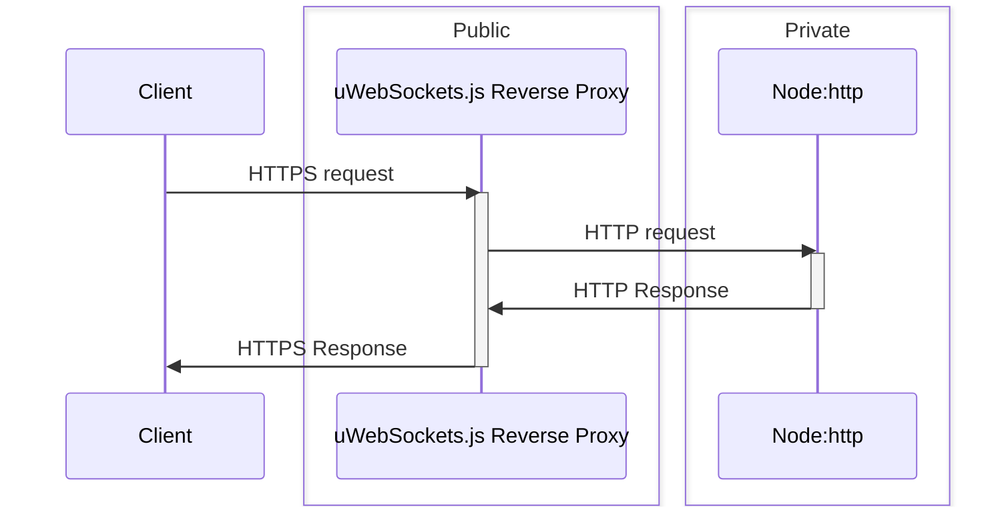

# uws-reverse-proxy

This project is an **easy-to-use 0-dependency**\* reverse proxy based on [uWebSockets.js](https://github.com/uNetworking/uWebSockets.js/). It enables use of `uWebSockets.js` and any `http`
server (as [express](https://www.npmjs.com/package/express), [NestJS](https://nestjs.com/), [Fastify](https://www.fastify.io/)) on **the same port**.

Tested with:

- uWebSockets.js v20.10.0
- NodeJS v18.0.0

\* _This package doesn't even depend on `uWebSockets.js` not to force any version usage, see in examples below._
_That said, keep in mind that only the last version of uWebSockets.js has been tested._

## How does it work?

It basically uses `uWebSockets.js` as a reverse proxy for all non-websocket traffic and forward it to any
`http` server.

Then it will send the response back to the client without modification.

## Why? For what use case?

Don't use this package if you don't **really** need it.

You pretty much always want your NodeJS app available on only one port (**443**) for it to be accessible in restrictive **NATs**.

This project is aimed to provide a solution in **restricted server environments** such
as some cloud platforms like Heroku, where you can't set up a proxy like **Nginx** or **Apache** in front of your NodeJS application,
and where you often have only one public port available.

If you're not in a similar use case, just set up an **Nginx** or **Apache** proxy that will filter the requests to redirect them on
the good **private** port, they will be more efficient and flexible.

Conversely, if your server has to work in **restricted server environment** or if for whatever reason you want `uWebSockets.js`
to handle all requests without standing behind a proxy, then this package is made for you :)

In the case of **express** you _could_ use a package like [http-proxy-middleware](https://www.npmjs.com/package/http-proxy-middleware)
to do the opposite (using `express` as a reverse proxy to forward requests to `uWebSockets.js`), but this doesn't seem to work at the time
I'm writing this, and **it defeats the main advantage of `uWebSockets.js`**: its astonishing performances.

## Important note about SSL

If `uWebSockets.js` and your `http` servers are on the same machine, you should not create an HTTPS server,
as TLS will add a useless overhead in a scenario like this:



## Installation

With npm:

```bash
npm install uws-reverse-proxy
```

With yarn:

```bash
yarn add uws-reverse-proxy
```

## Usage

This section describes some usage scenario. You can even see them in action in the
[examples repository](https://github.com/jordan-breton/uws-reverse-proxy-examples).

To see all available options, check the [code API documentation](https://jordan-breton.github.io/uws-reverse-proxy/).

### Basic

Simplest use-case: let the reverse proxy create everything on its own, configure your servers afterward.

```js
const uWebSockets = require('uWebSockets.js');
const http = require('http');

const {
	UWSProxy,
	createUWSConfig
} = require('uws-reverse-proxy');

const port = process.env.PORT || 80;

const proxy = new UWSProxy(
	createUWSConfig(
		uWebSockets,
		{ port }
	)
);

const httpServer = http.createServer((req, res) => {
	console.log('Incoming request: ', req);

	res.writeHead(200);
	res.end('Hello world :)');
});
httpServer.listen(
	proxy.http.port,
	proxy.http.host,
	() => console.log(`HTTP Server listening at ${proxy.http.protocol}://${proxy.http.host}:${proxy.http.port}`)
);

proxy.start();

// Configuring the uWebSockets.js app created by the proxy

// Setting up websockets
proxy.uws.server.ws({
	upgrade : () => {
		//...
	}
	// ...
});

// Listening
proxy.uws.server.listen('0.0.0.0', port, listening => {
	if(listening){
		console.log(`uWebSockets.js listening on port 0.0.0.0:${port}`);
	}else{
		console.error(`Unable to listen on port 0.0.0.0:${port}!`);
	}
});
```

Second use case: providing already created and listening `uWebSocket.js` server.

```js
const http = require('http');
const { App } = require('uWebSockets.js');

const port = process.env.PORT || 80;
const httpPort = process.env.HTTP_PORT || 35794;
const httpHost = process.env.HTTP_HOST || '127.0.0.1';

// Let's imagine that all the setup happen there, including listening
const httpServer =  http.createServer(/*...*/);
httpServer.listen(httpPort, httpHost, () => console.log(`HTTP server listening at http://${httpHost}:${httpPort}`));

const uwsServer = App();
uwsServer.ws({/* ... */});
uwsServer.listen('0.0.0.0', port, () => { /* ... */ });

const {
	UWSProxy,
	createUWSConfig,
	createHTTPConfig 
} = require('uws-reverse-proxy');

const proxy = new UWSProxy(
	createUWSConfig(
		uwsServer,
		{ port } // Must be specified to avoid a warning
	),
	createHTTPConfig(
		{
			port: httpPort, 
			host: httpHost
		}
	)
);
proxy.start();
```

The warning is there as a reminder especially if you use different ports than the default ones.

If you don't want (or can't) provide the `port`, you can silence the warning using the `quiet` option:

```js
const proxy = new UWSProxy(
	createUWSConfig(
		uwsServer,
		{ quiet: true }
	)
);
proxy.start();
```

### With SSL

Given the above examples, just change the options passed to `createUWSConfig`.

#### Letting the proxy creating the `uWebsockets.js SSLApp`:

```js
const uWebSocket = require('uWebSockets.js');
const { createUWSConfig } = require('uws-reverse-proxy');

createUWSConfig(
	uWebSocket,
	{
		config: {
			key_file_name: 'misc/key.pem',
			cert_file_name: 'misc/cert.pem'
		}
	}
)
```

#### Providing a `uWebsockets.js SSLApp`:

```js
const { SSLApp } = require('uWebSockets.js');
const { createUWSConfig } = require('uws-reverse-proxy');

const uwsServer = SSLApp({
	key_file_name: 'misc/key.pem',
	cert_file_name: 'misc/cert.pem'
});

createUWSConfig(
	uwsServer,
	{ quiet: true }
)
```

### Integration examples with Express, Koa, Fastify, Nestjs, Node:http

Please visit the [examples repository](https://github.com/jordan-breton/uws-reverse-proxy-examples).

It even contains a standalone mode to help you test `uws-reverse-proxy` with your own app without
changing a line of code for most projects.

**Keep in mind that it's... an HTTP reverse proxy. It can forward request to any HTTP server.**

## A word about performances

Putting a proxy in front of your application always induces a performance penalty. This performance penalty heavily depends
on the way you integrate the proxy to your application.

Just keep in mind that contrary to using a proxy like Apache or Nginx, uws-reverse-proxy will only impact the HTTP part
of your application. Since it is uWebSockets.js that handle all the trafic, your websockets are directly exposed to the Internet.

This proxy is especially useful for websockets heavy applications in the uses cases you can find in the
[Why? For what use cases?](#why-for-what-use-cases) section.

### Performance penalty in function of the integration mode

They are two main ways to integrate the proxy to your application:

- **Standalone mode**: the most efficient. The proxy and your application are running in two different processes.
- **Integrated mode**: the least efficient. The proxy and your application are running in the same process.

While you can expect almost no performance penalty in standalone mode, in integrated mode, the performance penalty
is about **30% to 45%**.

In standalone mode, the performance penalty is comprised between **3% to 10%** as long as your HTTP server maximum capacity do not exceed this proxy maximum capacity.

As a matter of fact, in my test environnement, the proxy is able to handle up to 45 000 req/s while an Express server is only
able to handle 9 500 req/s. So, in this case, the proxy is able to handle more requests than the Express server: you'll see almost
no performance penalty.

But if you test the proxy with a uWebSockets.js backend server (which is stupid, but it's to illustrate the point),
while the proxy is able to handle up to 45 000 req/s, the uWebSockets.js server is able to handle more or less 250 000 req/s.
In this case, you end up with a 500% performance penalty.

I advise you to test the proxy to be sure that it fits your needs and that it's not a bottleneck in your specific case.

That being said, you'll find below a table with the performance penalty I measured in my test environnement for the different
frameworks I tested. You'll see an average in both standalone and integrated mode vs no proxy at all.

### Performance comparison

Environment:

| Component | Specifications                                    |
| --------- | ------------------------------------------------- |
| OS        | Ubuntu 22.04.2 LTS 64 bits                        |
| Node      | v18.15.0                                          |
| RAM       | 16 Gio                                            |
| Processor | 11th Gen Intel® Core™ i7-11800H @ 2.30GHz × 16 |

No DNS resolution, all servers will listen on the loopback address.

All results are the average of 5 runs of 10 seconds each by using
[autocannon](https://github.com/mcollina/autocannon) with the following command:

```bash
autocannon localhost:7777
# Or, when testing without proxy
autocannon localhost:35794
```

Benchmarks are made with the [uws-reverse-proxy-examples repository](https://github.com/jordan-breton/uws-reverse-proxy-examples)

- In **standalone mode**, the proxy is started with `PORT=7777 yarn standalone:reverse-proxy`, then the target HTTP
  server is started with `yarn standalone:[framework]`.
- In **integrated mode**, we start the server with the command `PORT=7777 yarn [framework]`.

#### Results

| Framework                 |    No proxy | Standalone mode | Integrated mode |
| ------------------------- | ----------: | --------------: | --------------: |
| None (native http module) | 18024 req/s |     17000 req/s |      9803 req/s |
| Koa                       | 13079 req/s |     12400 req/s |      8492 req/s |
| Fastify                   | 12372 req/s |     11284 req/s |      7817 req/s |
| Nestjs                    |  9786 req/s |      8813 req/s |      6153 req/s |
| Express                   |  9362 req/s |      9102 req/s |      6375 req/s |

For readability, I've rounded the results to the nearest integer. A better view of the performance penalty can be
found in the table below based on the results above.

| Framework                 | Standalone mode | Integrated mode |
| ------------------------- | --------------: | --------------: |
| None (native http module) |           5.68% |          45.61% |
| Koa                       |           5.20% |          35.10% |
| Fastify                   |           8.80% |          36.81% |
| Nestjs                    |           9.94% |          37.12% |
| Express                   |           2.78% |          31.91% |

## TODO

- [X]  PoC (> v1.0.0)
- [X]  Refactoring + Clean & stable implementation (>= v2.0.2)
  - [X]  Flexible configuration
  - [X]  Config validation
  - [X]  Config warnings
  - [X]  Configurable backpressure threshold
  - [X]  Code comments & JSDOC
- [X]  Generic reverse proxy for any HTTP/HTTPS server
- [X]  Documentation
  - [X]  Code API
  - [X]  README
  - [X]  A demo repository.
- [X]  Publish on NPM
- [X]  Better error management
  - [X]  Allow answering stream errors that are happening before the client response is written
    with proper HTTP formatted response instead of shutting down the connection like a savage.
  - [X]  Allow for errors customization
- [X]  When a content-length header is present in the response, using uWebSockets.js `tryEnd` instead
  of `write`to avoid adding `Transfer-Encoding: chunked` to every request.
- [ ]  Edge cases handling regarding proxying (HTTP 100 continue, headers cleanup)
- [X]  Testing a `node:http` client to [`undici`](https://github.com/nodejs/undici) client migration to see performances impact.
- [X]  Custom HTTP client implementation to avoid using `node:http` client.
- [ ]  More flexibility in requests routing through proxy (add more control options, like a pre-handler to allow or not
  forwarding based on custom logic.)
- [ ]  Test uWebSockets.js version agnosticity for all uWebSockets.js versions.
  - [ ]  Support backward compatibility
- [ ]  Automated tests included in CI/CD
  - [X]  HTTP/1.1 parser tests
- [ ]  Debugging mode with console logging
